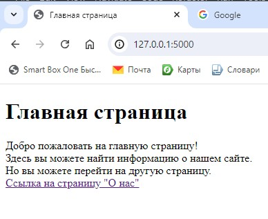

<h2>Работа с шаблонизатором и HTML шаблоны</h2>

Создайте свой HTML-шаблон (файл base.html).

Создайте страницы home.html и about.html, 
которые будут расширять шаблон и заполнять его контентом.

<h2>Результат выполнения задания</h2>

